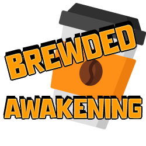

# 🅱🆁🅴🆆🅴🅳 🅰🆆🅰🅺🅴🅽🅸🅽🅶

<p align="center"></p>

## Description 

<div style="text-align: justify">
Introducing the Brewed-Awakening Project - an innovative solution that will revolutionize the way Super-Cafe manages its sales data.

As Super-Cafe continues to expand across the country, their sales data has been increasing exponentially, leading to an urgent need for an efficient and effective data management system. The current system of using Comma Separated Values format for tracking data has become outdated and unreliable, leading to a lot of manual work and errors.

With the Brewed-Awakening Project, our team will be creating a state-of-the-art software solution that will meet all of Super-Cafe's data management needs. We aim to deliver a fully functional product by the end of Week 5 that will be ready for testing. Our software will feature core functionality that will help Super-Cafe expertly and efficiently organize its data, leading to improved sales in the long run.

During Week 6, we will focus on refining and polishing the code while adding any new non-essential functions. Our ultimate goal is to provide Super-Cafe with a comprehensive solution that is easy to use and maintain, so they can focus on growing their business domestically and internationally. With our software in place, Super-Cafe will have a competitive edge over its competitors, allowing it to dominate the market and become a leader in the industry.
</div>

<!-- Our client Super-Cafe have experienced unprecedented growth over the last few months and have thus expanded to multiple branches nationwide. 
However with this growth has come a fair amount of sales data inflowing into their systems. 
Their old method of using Comma Separated Values format for tracking their data is outdated and needs an upgrade to keep up with demand.
This is where the Brewed-Awakening Project comes into play.
Our project by the end of Week 5 will have a finished product in the demo phase, ready to be tested which will fulfill all requirements. 
This product will have core functionality and we will use week 6 to improve and polish the code whilst adding any new non-essential functions. 
By this our client, Super-Cafe, will be able to expertly and efficiently organise their data which will improve sales in the long run leading to further growth internationally. -->

<br />


## Elevator Pitch

**FOR:** SUPER-CAFE COFFEE SHOP<br />
**WHO:** Wants to organise their sales data from multiple branches<br />
**THE:** Brewed Awakening Project<br />
**IS A:** ETL (Export, Transform, Load) Application<br />
**THAT:** Performs and allows Super-Cafe to analyse, organise and take control of their data through pipeline cleansing and visualisation.<br />
**UNLIKE:** Their old system of using CSVs<br />
**OUR PRODUCT:** Will allow them to make sense of their data and spot trends more efficiently as well as solves the problem of data inconsistencies and inaccuracies.<br />

<br /> 

## Installation Instructions
This section is a step-by-step guide on how to install and set up the project, including any dependencies or prerequisites required for our project.

* Install Python 3 on VS Code. This can be downloaded from the official website [here](https://www.python.org/downloads/) and follow the installation instructions. Once Python 3 is installed, make sure it's added to the system's PATH environment variable.

* Set up AWS. We will create an AWS account and set up an S3 bucket to store the project files. Follow the AWS documentation to create an S3 bucket and obtain an access key ID and secret access key.

* Set up Grafana. We'll need to download and install Grafana on our local machine. Once Grafana is installed, open a browser and navigate to http://localhost:3000 to access the Grafana dashboard. Log in with the default username and password (admin/admin).

* Clone the project repository. Use Git to clone the project repository to your local machine.
Install project dependencies. 

* Navigate to the project directory and run the following command to install the project dependencies:
```
pip install -r requirements.txt
```

Set up environment variables. Create a new file named `.env` in the project directory and add the following environment variables:
```
AWS_ACCESS_KEY_ID=your_access_key_id
AWS_SECRET_ACCESS_KEY=your_secret_access_key
GRAFANA_API_KEY=your_grafana_api_key
```
Replace `your_access_key_id`, `your_secret_access_key`, and `your_grafana_api_key` with your actual values.
<br /> <br/>

## Configuration
This section provides information on how to customize the project to meet the specific needs. This section may include details on how to modify settings, configure options, or adjust parameters to optimize the project. By providing clear and concise instructions on how to configure the project, we can help users get the most out of the software and ensure that it meets their unique requirements.
<br /> <br />

### **Database Schema**
*Please insert image*
### **Lambda Schema**
*Please insert image*

### **Setting up the Database**
* Choose a database management system (DBMS) e.g. MySQL, PostgreSQL.
* Install the DBMS on your computer. For the Brewed Awakening Project we have chosen to use Adminer SQL. [Why?](#why-adminer-sql)
* Create a new database for the project using the GUI Interface.
* Create the necessary tables for the project and define the schema for each table including: Column names,
data types and any constraints.
* Add any necessary indexes to the tables created. This can improve the performance of any queries by allowing the adbms to quickly locate the data you're looking for.
* Write any necessary scripts to populate the database and to insert data into tables.
* Test the database setup to ensure everything is running smoothly. Run queries against the database using Adminer SQL commands that retrieve, modify or delete data in the database.
<br/>
<br/>

### **Configuring the Database connection**
To configure the database connection using Adminer SQL, you'll need to follow these steps:

* Open your web browser and navigate to the Adminer SQL login page.
* Enter the database server hostname, port number, username, and password.
For example, if you're running a local database server on port 8080, you might enter `localhost:8080` for the hostname and port number.
* Click the "Login" button to log in to the database server.

Once you've logged in to the database server, you should be able to create, edit, and delete databases and tables using the Adminer SQL interface.
<br/> <br/>

### **Customising the Data Schema**

Super-Cafe's data schema can be customized to meet your specific needs. To do this, you'll need to modify the database tables using Adminer SQL. Here's how to add or remove tables and modify the data types of existing fields:

#### **Adding a Table**
To add a new table to the database, follow these steps:

* Log in to the database server using Adminer SQL.
* Click the "SQL command" button to open the SQL command prompt.
* Enter the SQL command to create the new table.
* For example, to create a new table called `orders` with the fields `order_id`, `customer_id`, and `order_date`, you would enter the following SQL command:
   
   ```sql
   CREATE TABLE orders (
     order_id INT PRIMARY KEY,
     customer_id INT,
     order_date DATE
   );
   ```
Here are some other SQL commands to follow
#### **Removing a Table**
```sql
   DROP TABLE orders;
   ```

#### **Adding a One-to-Many Relationship**
To add a one-to-many relationship between two tables in the database, follow these steps:

* Log in to the database server using Adminer SQL.
* Click the "SQL command" button to open the SQL command prompt.
* Enter the SQL command to add a foreign key constraint to the child table.
* For example, to create a one-to-many relationship between the `orders` and `customers` tables using the `customer_id` field, you would enter the following SQL command:
   
   ```sql
   ALTER TABLE orders
   ADD CONSTRAINT fk_orders_customers
   FOREIGN KEY (customer_id)
   REFERENCES customers(customer_id);
   ```
   <br/>

## Usage
This section provides instructions on how to use the project, including any dependencies or prerequisites required for the project, as well as examples and code snippets. 
This section is designed to help users quickly get up and running with the project, and to provide guidance on how to use the project's features and functionality. 
<br/>

### **Template for Help or Code**

Any explanation that needs code snippets should be posted like this.
```
Everything inside the quotes will look like this... will be used for instructions, code etc... 
```
### **Template for Bullet point list**

* To use Bullet points is just add an * before the text
* New lines that start with * will be bullet points

<br />

### **Navigating Directories**
Here are some common commands used to navigate directories in the terminal:

```
"pwd": prints the current working directory
"ls": lists the files and directories in the current working directory
"cd": changes the current working directory to a new directory
"cd ..": changes the current working directory to the parent directory of the current directory
"mkdir": creates a new directory
"rm": removes a file or directory
"cp": copies a file or directory
"mv": moves a file or directory
"touch": creates a new file
```

<br/>

### **Essential Git Commands**

``` 
`git clone`: Clone a repository from a remote source
`git add`: Add changes to the staging area
`git commit`: Commit changes to the local repository
`git push`: Push changes to a remote repository
`git pull`: Pull changes from a remote repository
`git status`: Show the status of the working directory
`git log`: Show the commit history of the repository
`git branch`: List, create, or delete branches
`git checkout`: Switch branches or restore working tree files
`git merge`: Merge one or more branches into the current branch
`git stash`: Stash changes in a dirty working directory away
```
<br/>

### **Essential Docker Commands**

```
`docker build`: Build an image from a Dockerfile
`docker run`: Run a container from an image
`docker ps`: List running containers
`docker stop`: Stop a running container
`docker rm`: Remove a container
`docker images`: List images on the local machine
`docker rmi`: Remove an image
`docker logs`: Print the logs of a container
`docker exec`: Run a command inside a running container
`docker-compose up`: Start all the services defined in a docker-compose.yml file
```

## Why Adminer SQL?
There are several benefits to using Adminer SQL as a database management tool:

* Lightweight: Adminer SQL is a lightweight tool that can be easily installed and used on most systems. It has a small memory footprint and can be run on low-resource systems.
* User-friendly interface: Adminer SQL provides a user-friendly web-based interface that makes it easy to manage databases, run queries, and perform other database-related tasks. The interface is intuitive and easy to use, even for users who are not familiar with SQL.
* Multi-database support: Adminer SQL supports several popular database management systems, including MySQL, PostgreSQL, SQLite, and Oracle. This makes it a versatile tool that can be used across a variety of projects and applications.
*Customization: Adminer SQL is highly customizable and can be extended with plugins and themes. This allows users to tailor the tool to their specific needs and preferences.

We preferred to use Adminer SQL for our Brewed Awakening project, over other database management tools for these reasons. Additionally, because it is open source software, it is free to use and can be customized to meet specific needs. Its user-friendly interface and support for multiple database systems make it a popular choice for developers.
<br/><br/>

## Authors

* Jorge Rolo
* Mohamed Shafie
* Sadat Awuma 
* Saleem Mustafa
* Shekinah Kimvuidi

<br />

## Version History

* 0.1.01
    * Jupyter Notebook with local CSV handling functions added
* 0.1
    * Initial Release

<br />

<!-- Please keep this here for future updates of the version history
* 0.11
    * Various bug fixes and optimizations
    * See [commit change]() or See [release history]() -->

## Built With
The Brewed Awakening project was built using a combination of technologies, including:
* Python 3 for back-end 
* AWS Lambda for severless computing
* SQL For the Database
* Metrics and logs were collected from multiple sources including AWS S3 buckets, and displayed using Grafana dashboards.

<br/>

## Acknowledgments

Special Thanks, Inspiration, code snippets, etc.
* [Generation UK Program](https://uk.generation.org/)
* Our Mentors
* Not Barbara
* [W3 Schools](https://www.w3schools.com/)
* [Trello](https://trello.com/)